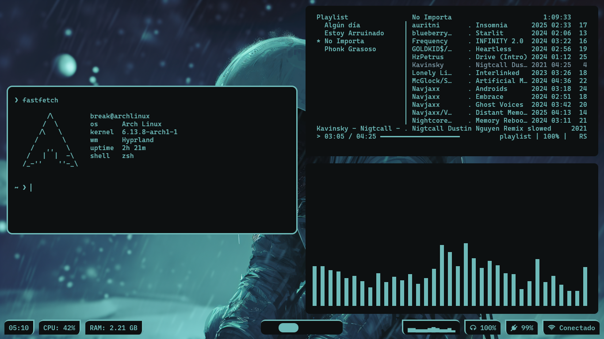
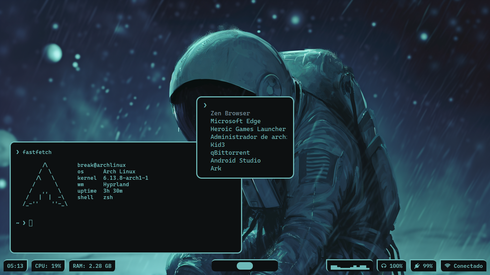
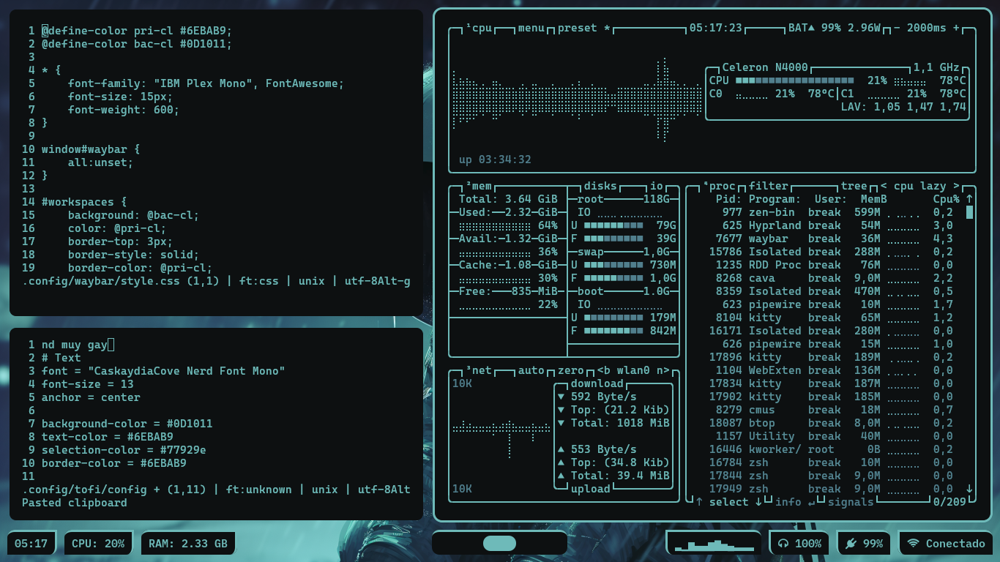
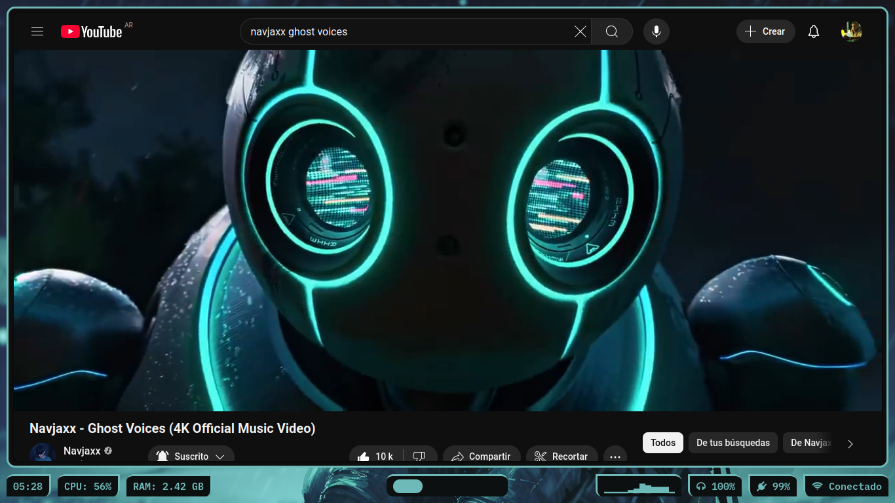

# 🔷 Hyprgay
**Una configuracion de Hyprland muy gay**

* **Windows Manager** • [Hyprland](https://hyprland.org) Me gustan los Tiles
* **Shell** • [Zsh](https://www.zsh.org/) Se ve bonito
* **Terminal** • [Kitty](https://sw.kovidgoyal.net/kitty/) Súper rápido y bonito
* **Text Editor** • [Micro](https://micro-editor.github.io/) Ligero y eficiente
* **Bar** • [Waybar](https://github.com/Alexays/Waybar) Linda barra
* **Music Player** • [Cmus](https://cmus.github.io/) Reproductor de musica Gay
* **System Monitor** • [Btop](https://github.com/aristocratos/btop) Para ver todo lo que pasa en tu PC
* **Visualizations** • [Cava](https://github.com/karlstav/cava) Barritas locas
* **Terminal Fetch** • [Fastfetch](https://github.com/dylanaraps/fastfetch) Para presumir tu ArchGay

# 💙 Setpu
  
  
  


# 🔵 Instalación

```bash
sudo pacman -Syu
sudo pacman -S git
cd ~
git clone --depth=1 https://github.com/LAGTactico7/Hyprgay?tab=readme-ov-file
cd hyprgay
./install.sh
```

(si no te funciona el install.sh.. lo siento mucho de verdad...
porque no pienso darte instrucciones Nya)
